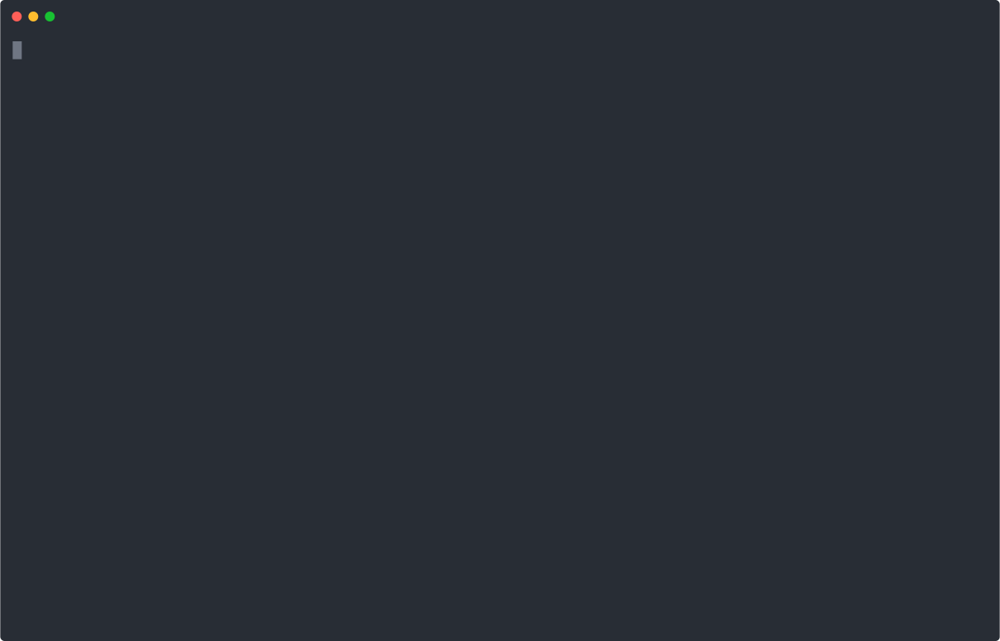

# EphemeralEnvironment Operator

**Disposable Kubernetes environments that delete themselves.**

`EphemeralEnvironment` is a Kubernetes operator that provisions a self-cleaning, time-limited sandbox — a namespace running a containerized workload — which automatically tears itself down when its TTL expires. Disposable environments like PR previews, demos, and test sandboxes never have to be cleaned up by hand.



---

## The problem

Throwaway environments pile up. A PR preview, a demo namespace, a quick test sandbox; needs a containerized workload, a place to run it, and somebody to remember to delete it afterward. The "remember to delete it" step is where it falls apart: orphaned environments quietly run up cloud bills for weeks.

`EphemeralEnvironment` makes the cleanup automatic. You declare *what* to run and *how long* it should live; the operator provisions a namespace, runs the workload, and deletes everything when the clock runs out. No cron job, no cleanup script, no forgotten namespaces.

```yaml
apiVersion: ephemeral.hoaqim.dev/v1alpha1
kind: EphemeralEnvironment
metadata:
  name: pr-123
spec:
  ttl: "2h"
  template:
    spec:
      containers:
        - name: web
          image: myapp:pr-123
          ports:
            - containerPort: 8080
```

Apply that, and you get a namespace with the workload running, reachable via a Service, for exactly two hours.

---

## Architecture

The operator is a single reconciler that drives one custom resource through a simple lifecycle. It is deliberately a **primitive**: it knows how to make and destroy time-bounded sandboxes, and nothing else. It has no knowledge of GitHub, PRs, or CI. The wiring lives in a thin layer outside the operator (see [PR previews](#using-it-for-pr-previews)).

```
                 ┌─────────────────────────────────────────┐
                 │              Reconcile(name)             │
                 │  (called on every event — idempotent)    │
                 └───────────────────┬─────────────────────┘
                                     │
              ┌──────────────────────┼──────────────────────┐
              ▼                      ▼                      ▼
        being deleted?         past its TTL?           otherwise
              │                      │                      │
              ▼                      ▼                      ▼
     delete namespace         delete the CR         ensure namespace
     drop finalizer        (cascades cleanup via    ensure workload
        (cascade)            the finalizer)          ensure service
                                                     set status: Ready
                                                     requeue at expiry
```

When a CR is created, the reconciler assigns a namespace, provisions the workload, exposes a Service, and records the expiry time in status. It then re-queues itself to wake at exactly the moment of expiry. On expiry, it deletes the CR, which trips a finalizer that cascades the namespace teardown. Expiry and manual deletion therefore share one cleanup path.

### Custom resource reference

**`spec`** (you set this — desired state):

| Field | Type | Description |
|-------|------|-------------|
| `ttl` | duration string | How long the environment lives before it automatically tears down, e.g. `"30m"`, `"2h"`. Defaults to `1h`. |
| `template` | PodTemplateSpec | The pod template for the workload. The first container's first `containerPort`, if set, is exposed via a Service. |

**`status`** (the operator sets this — observed state):

| Field | Type | Description |
|-------|------|-------------|
| `phase` | enum | Current lifecycle phase: `Pending`, `Ready`, `Expiring`, or `Failed`. |
| `namespace` | string | Name of the namespace provisioned for this environment. |
| `expiresAt` | timestamp | The time at which the environment will be torn down. |

Because `template` is a full `PodTemplateSpec`, any pod-level configuration works out of the box: environment variables, resource limits, liveness/readiness probes, volumes, multiple containers. Run `kubectl explain ephemeralenvironment.spec` to browse the full schema.

---

## Quickstart

Install the operator with Helm and watch a sample environment provision and self-destruct.

### Prerequisites

- A Kubernetes cluster (a local [Kind](https://kind.sigs.k8s.io/) cluster is fine)
- `kubectl` and `helm`

### Install

```bash
helm install ee-operator \
  oci://ghcr.io/hoaqim/charts/ee-operator \
  --namespace ee-operator-system --create-namespace
```

> If you are installing from a local checkout instead, point Helm at the chart directory:
> ```bash
> helm install ee-operator ./chart/ee-operator \
>   --namespace ee-operator-system --create-namespace
> ```

Confirm the operator is running:

```bash
kubectl get pods -n ee-operator-system
```

### Try it

```bash
kubectl apply -f config/samples/ephemeral_v1alpha1_ephemeralenvironment.yaml

kubectl get ephemeralenvironment
kubectl get ephenv          

NS=$(kubectl get ephenv ephemeralenvironment-sample -o jsonpath='{.status.namespace}')
kubectl get all -n "$NS"
```

`kubectl describe ephenv ephemeralenvironment-sample` shows a timeline of events without digging through logs.

When the TTL elapses, the CR and its namespace disappear on their own.

---

## Using it for PR previews

The operator is a general-purpose primitive, so PR previews are something you build *with* it, not a feature inside it. A thin layer (eg. GitHub Actions workflow, a small webhook service, or Argo CD's Pull Request Generator) translates PR events into CRs:

- **PR opened / pushed** → `kubectl apply` an `EphemeralEnvironment` whose `template` references the image CI just built (`myapp:pr-123`). Re-applying on each push refreshes the TTL, keeping the environment alive while the PR is active.
- **PR closed** → delete the CR; the namespace cascades away.

The TTL is a **safety net**: if the layer ever crashes or forgets to clean up, the environment still self-destructs. Dangling preview environments are a real and expensive problem, so a TTL backstop is pretty useful property rather than a limitation.

The operator never builds images or touches a git repo -> CI builds the image, the CR just references it. This keeps the operator a clean, reusable brick.

---

## Observability

The operator exposes Prometheus metrics on `:8443` (controller-runtime's built-in reconcile metrics: reconcile count, error count, and duration), secured behind controller-runtime's default authn/authz filter. Scraping in a real cluster requires a `ServiceMonitor` and metrics-reader RBAC, which are deployment-specific and not bundled in the chart.

A useful alerting rule — fire if the reconciler starts erroring:

```yaml
groups:
  - name: ee-operator
    rules:
      - alert: EphemeralEnvironmentReconcileErrors
        expr: rate(controller_runtime_reconcile_errors_total{controller="ephemeralenvironment"}[5m]) > 0
        for: 5m
        labels:
          severity: warning
        annotations:
          summary: "EphemeralEnvironment reconciler is erroring"
          description: "The controller has logged reconcile errors over the last 5 minutes."
```

---

## Design decisions

The interesting parts of this project are the choices that aren't obvious from a tutorial. Each of these was a real fork in the road.

### Cleanup uses finalizers and namespace cascade, not owner references

The instinct is to set the CR as owner of its children so Kubernetes garbage-collects them automatically. That doesn't work here for two reasons: the Deployment and Service live in a **different namespace** than the CR (cross-namespace owner references are disallowed by design), and the namespace itself is **cluster-scoped** while the CR is namespaced. So cleanup runs on two other mechanisms instead: child resources die by **namespace cascade**, and the namespace itself is removed by a **finalizer**. A consequence is that `.Owns()` self-healing isn't available (it relies on owner references), which is an acceptable trade for a disposable environment.

### TTL expiry re-queues instead of polling

On each reconcile, the controller returns `RequeueAfter: timeUntilExpiry` rather than checking the clock on a fixed interval. The controller sleeps and wakes at *exactly* the moment of expiry. This scales to thousands of environments without burning CPU on idle polling.

### Expiry self-deletes the CR, reusing the teardown path

When a TTL expires, the controller deletes the **CR itself** rather than tearing the namespace down directly. Deleting the CR trips the finalizer, which cascades the namespace cleanup. TTL expiry and manual `kubectl delete` thus flow through the same teardown code.

### Status is the source of truth for the namespace name

The provisioned namespace gets a random suffix (`ee-<name>-<random>`) to avoid collisions when two CRs share a name across different parent namespaces. Because the name is non-deterministic, `status.namespace` is the *only* record of it. The controller writes it to status **before** creating the namespace. IF it created the namespace first and crashed, it would orphan a namespace it could never find again. State before side-effects.

### The workload field is a full PodTemplateSpec

Using `corev1.PodTemplateSpec` for `spec.template` mirrors the API shape of built-in controllers like Deployment, and gives users env vars, resource limits, probes, and multi-container pods for free. The cost is a large generated CRD. Embedding the entire pod schema pushes it past 256 KB. This drives two further decisions below.

### Server-side apply everywhere

The CRD's size exceeds the 256 KB limit that client-side `kubectl apply` relies on (it stuffs prior state into an annotation). All apply paths: `make install`, `make deploy`, and the Helm chart, use **server-side apply**, which tracks field ownership on the API server instead of writing that annotation, sidestepping the limit. This is the recommended approach for CRDs regardless of size.

### Tooling waits for the CRD to be Established

The same large schema means the API server needs measurable time to register the CRD after it's applied. Applying a CR too quickly afterward fails with "no matches for kind." Tests and install steps wait for the `Established` condition before creating any custom resources.

### The Helm chart ships the CRD in a separate `crds/` directory

Helm installs files in `crds/` once, before templates, outside the release lifecycle, which both matches the recommended production pattern for operators *and* sidesteps the client-side apply size limit. The technical constraint and the "more correct" choice happen to point the same way.

### Leader election requires a namespaced leases Role

The operator runs with `--leader-elect` for HA-safe, single-active reconciliation. This requires a namespaced `Role` granting access to `coordination.k8s.io/leases` (and `events`), packaged in the chart's leader-election RBAC template. This was caught by testing the chart on a fresh cluster. Without it, the operator deploys successfully but silently never reconciles, because it's stuck trying to acquire a lease it can't read.

---

## Development

```bash
# run the controller locally against your current kubecontext
make install        
make run            

# unit tests coverage ~87%
make test

# 4 e2e tests again a cluster
make test-e2e
```

Built with [Kubebuilder](https://book.kubebuilder.io/) and [controller-runtime](https://github.com/kubernetes-sigs/controller-runtime).

---

## Future work

Deliberately out of scope for this version, to keep the operator a focused primitive:

- **Additional source types** — fetching workloads from a git repo or rendering a Helm chart, as an alternative to the inline pod template.
- **A validating admission webhook** — rejecting out-of-bounds TTLs at admission time (currently enforced via CRD validation).
- **TTL extension on activity** — keeping an environment alive while it's actively in use.
- **Per-team quotas** — limiting how many environments a team can run concurrently.